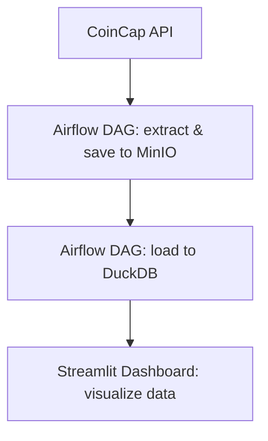

# ELT Pipeline with Airflow, MinIO, DuckDB and Streamlit

This project demonstrates an end-to-end ELT pipeline using the following tools:

- **Apache Airflow** – for orchestration
- **MinIO** – as an object storage (S3-compatible)
- **DuckDB** – as a fast local analytical database
- **Streamlit** – for interactive dashboards and data exploration
- **Python** – for writing scripts that extract, load and transform data

---

## 🔁 Project Workflow

## Setup

To run the application, please follow these steps:

1. Create a folder named `secrets` in the root directory of the project.
2. Inside the `secrets` folder, create a file named `Api_Key` containing the generated API key from CoinApi.
3. Generate an appropriate API key for the application integration and place it inside the `Api_Key` file.

The `secrets/Api_Key` file is not included in the repository to ensure the security of API keys.

