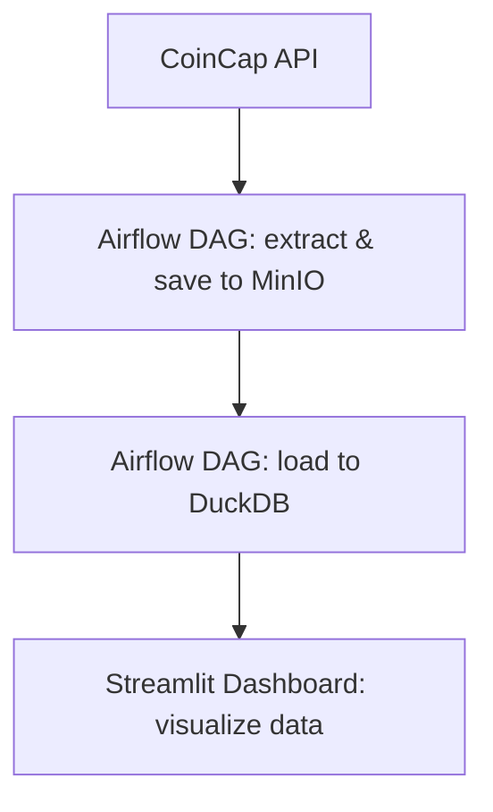

# ELT Pipeline with Airflow, MinIO, DuckDB and Streamlit

This project demonstrates an end-to-end ELT pipeline using the following tools:

- **Apache Airflow** – for orchestration
- **MinIO** – as an object storage (S3-compatible)
- **DuckDB** – as a fast local analytical database
- **Streamlit** – for interactive dashboards and data exploration
- **Python** – for writing scripts that extract, load and transform data

---

## 🔁 Project Workflow

## Setup

To run the application, please follow these steps:

1. Create a folder named `secrets` in the root directory of the project.
2. Inside the `secrets` folder, create a file named `Api_Key` containing the generated API key from CoinApi.
3. Generate an appropriate API key for the application integration and place it inside the `Api_Key` file.

The `secrets/Api_Key` file is not included in the repository to ensure the security of API keys.

## CoinDataExtractor Class Methods

The `CoinDataExtractor` class provides several methods for fetching, uploading, and loading cryptocurrency data. Below are the key methods available in the class:

### 1. `get_coin_data()`
- **Purpose**: Fetches cryptocurrency data from the CoinCap API for a specified asset (e.g., Bitcoin) starting from a given `start_date` and saves it to a CSV file.
- **Parameters**:
  - `asset_id` (str): The cryptocurrency asset identifier (e.g., `bitcoin`).
  - `start_date` (str, optional): The starting date in "YYYY-MM-DD" format. Default is "2021-01-01".
  - `interval` (str, optional): The data interval (e.g., "h1" for hourly). Default is "h1".
- **Usage**:
  - This method is used to fetch historical price data from CoinCap and store it as a CSV file for later processing.

### 2. `upload_file_to_minio()`
- **Purpose**: Uploads the CSV file generated by `get_coin_data()` to MinIO, a local object storage service compatible with S3.
- **Usage**:
  - After fetching the data and saving it to a CSV file, this method uploads the file to MinIO and deletes the local copy.

### 3. `create_bucket()`
- **Purpose**: Creates a bucket in MinIO for the specified asset if it does not already exist.
- **Usage**:
  - This method ensures that there is a dedicated bucket in MinIO for each asset (e.g., Bitcoin), which is required for storing and managing data files.

### 4. `get_last_load()`
- **Purpose**: Returns the date of the last data load from DuckDB, or the start date if no data exists. This helps determine the date from which new data should be loaded.
- **Usage**:
  - This method is useful for incremental data loads, ensuring that only new data is fetched from the CoinCap API.

### 5. `load_data_from_minio_to_duckdb()`
- **Purpose**: Loads data from a CSV file stored in MinIO into DuckDB, creating a table if it does not exist. The method also inserts the new data into the table.
- **Parameters**:
  - `db_name` (str, optional): The name of the DuckDB database. Default is "historical_bitcoin.db".
- **Usage**:
  - This method is used to transfer the data stored in MinIO into a local DuckDB database for analysis and querying. It creates the necessary table structure and performs the data insertion.

---

By using these methods, you can efficiently fetch, store, and load cryptocurrency data for analysis and visualization.

