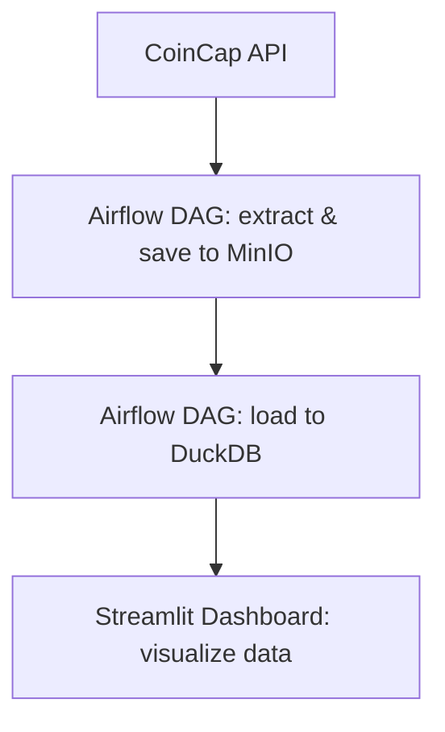

# ELT Pipeline with Airflow, MinIO, DuckDB and Streamlit

The updated version of the project is available here. The previous version can be found in the **tags** section.

The goal of this update is to automatically and dynamically fetch historical data for multiple assets in one run. This makes the data retrieval process more efficient and scalable, while also improving the functionality of the data warehouse. It allows for easier management of larger asset datasets and better integration into the data warehouse.

This project demonstrates an end-to-end ELT pipeline using the following tools:

- **Apache Airflow** – for orchestration
- **MinIO** – as an object storage (S3-compatible)
- **DuckDB** – as a fast local analytical database
- **Streamlit** – for interactive dashboards and data exploration
- **Python** – for writing scripts that extract, load and transform data

---

## 🔁 Project Workflow

## Setup

To run the application, please follow these steps:

1. Create a folder named `secrets` in the root directory of the project.
2. Inside the `secrets` folder, create a file named `Api_Key` containing the generated API key from CoinCap.
3. Generate an appropriate API key via this link https://pro.coincap.io/signin for the application integration and place it inside the `Api_Key` file.

The `secrets/Api_Key` file is not included in the repository to ensure the security of API keys.

---

# Summary of Changes Between Old and New Code Versions for **CoinDataExtractor** class

## 1. Class Initialization (`__init__` method)
- **Old version**: The class initialized with a `start_date` and interval (`h1` by default).
- **New version**: The class now uses a `start_year` (default `2024`) and `interval` (`d1` by default). The end date is set to the current year.

## 2. File Naming
- **Old version**: The file name was based on the asset ID and start date (`asset_id-start_date`).
- **New version**: The file names are generated for each year (from `start_year` to the current year), e.g., `asset_id-year`.

## 3. Data Fetching Method (`get_coin_data`)
- **Old version**: The data is fetched for a single day (from the `start_date`).
- **New version**: The data is fetched for a full year by converting the start and end of each year into UTC timestamps.

## 4. Error Handling
- **Old version**: Errors while fetching data were logged and the process returned early.
- **New version**: Same error handling approach, but with slightly more detailed logging for each year.

## 5. Uploading Data to Minio
- **Old version**: The file was uploaded to Minio for a single asset and date.
- **New version**: The files for each year are uploaded, and the method now processes multiple files.

## 6. Bucket Creation in Minio
- **Old version**: The bucket creation code existed but didn’t check if the bucket already existed.
- **New version**: The `create_bucket` method checks if the bucket exists before attempting to create it.

## 7. Loading Data from Minio to DuckDB
- **Old version**: Data was loaded from Minio to DuckDB for a specific file, and a table was created if it didn’t exist.
- **New version**: Data is loaded for each file associated with the asset ID and year. Additionally, the process ensures that the data is not duplicated by first removing any records with the same date.

## 8. Removed `get_last_load` Method
- **Old version**: There was a method to fetch the last load date from DuckDB.
- **New version**: This method was removed, as the focus shifted to loading data by year.

## 9. Temporary File Handling
- **Old version**: The temporary file was uploaded to Minio and removed afterward.
- **New version**: The same process is followed, but it now handles multiple files and removes each file after uploading and processing.

---

## New Files Added:

### `initialize_warehouse.py`
This file contains the logic to set up and create the necessary tables in DuckDB for the ELT pipeline. It includes the creation of `dim_assets`, `dim_date`, `history_price`, and `fact_coin_metrics` tables. Additionally, it includes a function to insert hourly date ranges into the `dim_date` table, which is required for time-based data processing.

### `fetch_all_assets.py`
This file fetches asset data from the CoinCap API and loads it into the `dim_assets` table. It extracts the `asset_id`, `name`, `rank`, and `symbol` fields for each asset, stores them in a DataFrame, and inserts them into the DuckDB database. It uses an API key for authentication, which is stored in a `.env` file.

### Key Functions:

- **`initialize_warehouse.py`**: 
    - Creates tables (`dim_assets`, `dim_date`, `history_price`, and `fact_coin_metrics`).
    - Inserts hourly date data into the `dim_date` table.

- **`fetch_all_assets.py`**:
    - Fetches data for all assets from CoinCap API.
    - Inserts asset data (`asset_id`, `name`, `rank`, `symbol`) into the `dim_assets` table.

---

## DAGs in the Project

### 1. `init_warehouse` DAG
This DAG is responsible for initializing the database warehouse by creating the necessary tables and loading initial data. It runs once to set up the environment.

**Tasks:**
- **`create_tables`**: Creates the necessary tables (`dim_assets`, `dim_date`, etc.) in DuckDB.
- **`initialize_date_table`**: Fills out the `dim_date` table with hourly date ranges.
- **`initialize_asset_table`**: Loads asset data from the CoinCap API into the `dim_assets` table.

**Task Order:**
1. `create_tables` → 2. `initialize_date_table` → 3. `initialize_asset_table`

### 2. `load_history` DAG
This DAG is responsible for loading historical data for cryptocurrency prices. It dynamically processes data for each coin, fetches the data, stores it in MinIO, and loads it into DuckDB.

**Tasks:**
- **`process_coin`**: Fetches coin data for a given coin.
- **`create_bucket`**: Creates a bucket in MinIO for storing the coin's data.
- **`upload_file_to_minio`**: Uploads the fetched data file to MinIO.
- **`load_data_from_minio_to_duckdb`**: Loads the data from MinIO into DuckDB.

**Dynamic Execution:**
The tasks are dynamically mapped for each coin (`binance-coin`, `bitcoin`, `ethereum`). The sequence for each coin is:
1. `create_bucket` → 2. `process_coin` → 3. `upload_file_to_minio` → 4. `load_data_from_minio_to_duckdb`

**Manual Task Linking:**
Tasks for each coin are manually linked in a sequence, ensuring that the process for each coin runs in order.

---

### Streamlit
Streamlit is currently in the process of being updated and integrated into the project. The changes will focus on improving the data visualization

